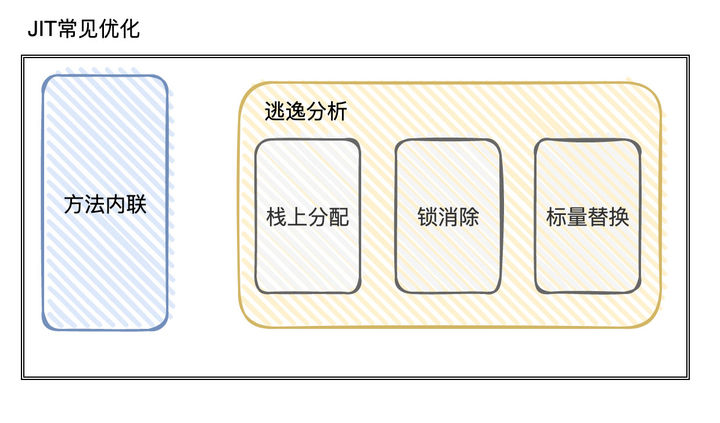

## 漫谈JVM调优

JVM最大的好处是跨平台，JVM帮我们做了回收对象的步骤，一定程度上降低了内存泄露的可能性，不用程序员手动释放对象了。

但是这样也使得Java程序员和底层隔了一层，不能对机器如臂使指，不方便压榨机器的性能。

就好比JPA和MyBatis，JPA大部分时候不需要写SQL，MyBatis需要写SQL，程序员使用MyBatis更方便进行SQL调优。

讲到这里，就要说一下平时出现性能问题要如何排查和优化。

从QPS是否增长的角度来看 ：

1. 如果是QPS暴涨，业务的访问人数剧增，这种要先考虑能不能加机器配置、横向扩容【如果是K8S就是自动扩容了】；如果流量只是一时的，就要想一下能不能做降级，优先保证主要的业务优先运行。其次还要分析一下有无优化的空间。
2. 如果QPS没有增长，但是速度慢很多，就要分析一下最近上线的的代码、SQL语句是否有问题【缩小排查空间】，可能是代码的时间复杂度和性能太差劲导致的，也可能是SQL语句没有命中索引。这种就要具体问题具体分析了。如果最近都没有更新，就要从数据库的数据量着手了，一个系统刚上线数据量少速度快，日积月累下数据量越多，性能就越差了。这种就要考虑是不是要加缓存了、分库分表，甚至可能要重构此功能。

如果从系统出现瓶颈的可能性来看排查的优先级是 ：

1. 数据库 ： 数据库的2000-3000QPS就已经很不错了，是整个系统中最容易出现性能瓶颈的地方。

   > 解决办法是 ：本地缓存、索引、分布式缓存、分库分表

2. 硬件的限制 ：再其次就可能是硬件的能力限制了性能，要考虑是否要做纵向、横向扩容

3. 从代码来分析 ：分析代码是否有问题，如果没有问题，也要考虑能不能以空间换时间

4. 从JVM来分析 ：JVM是否有频繁GC的问题

5. 从网络和OS角度来分析 ：以上都没问题，那就只能从最底层来分析了。从内存/cpu/网络/硬盘IO来分析了。

对于程序员来说，前三步已经很OK了，后两步一般不会有什么问题，但成为一个高手后两步是必经之路。

熟悉JVM调优可以帮助我们更好的优化程序。

### JVM的指标

---

1. 吞吐量 ：执行任务的时间，占总执行任务的时间。
2. 延迟 ：最少停顿时间【STW】和 停顿次数
3. 低内存占用 ：内存占用越少越好

> 停顿时间在某些场景下可能会有一些严重的后果，比如分布式锁，刚获得了锁，就发生了GC，然后长时间没有给锁续时，分布式锁超时释放，这样就有可能出现两个拿到锁的线程。

### JVM调优的步骤

---

1. 根据上线，或者压测时的运行情况，分析GC日志、dump文件，判断是否需要优化，确定瓶颈
2. 确定JVM调优目标【延迟、吞吐量、低内存占用哪个优先】，要达到什么效果
3. 确定JVM参数，测试调优后的指标
4. 不断分析、修改参数、测试，找到合适的JVM参数，能达到最初的目的参数
5. 应用到线上，进行后续的跟踪

### 分阶段的JVM调优

---

- **编写代码的时候**

  在编写代码的时候，就可以做一些调优的手段。比如 ：

  1. 估计需要多少内存，并设定 最小堆和最大堆为相等值。【避免内存伸缩导致申请、释放内存时的浪费】
  2. 设定元空间大小，并设置元空间大小和最大元空间大小相等【Metaspace达到阈值申请内存会Full GC】
  3. 设置`+HeapDumpOnOutOfMemory`，测试时或线上环境出现内存溢出可以根据镜像文件来分析

- **执行压测的时候**

  代码编写完成后，可以先本地跑一跑，看一看是否有频繁GC。

  `jstat -gcutil pid 1000`

  查看FGC和FGCT是否有异常。

  测试的时候可以执行`jmap -dump:format=b,file=heapdump.phrof pid`导出内存镜像文件。

- **根据线上反馈**

  线上反馈通常都是事故或者监控报警了，

  - 如果是内存溢出，则要分析是不是内存泄露
  - 如果是有卡顿，则要分析GC的次数和GC的时间

1. 设置JVM的最大内存和最小内存相等，避免申请、释放内存

