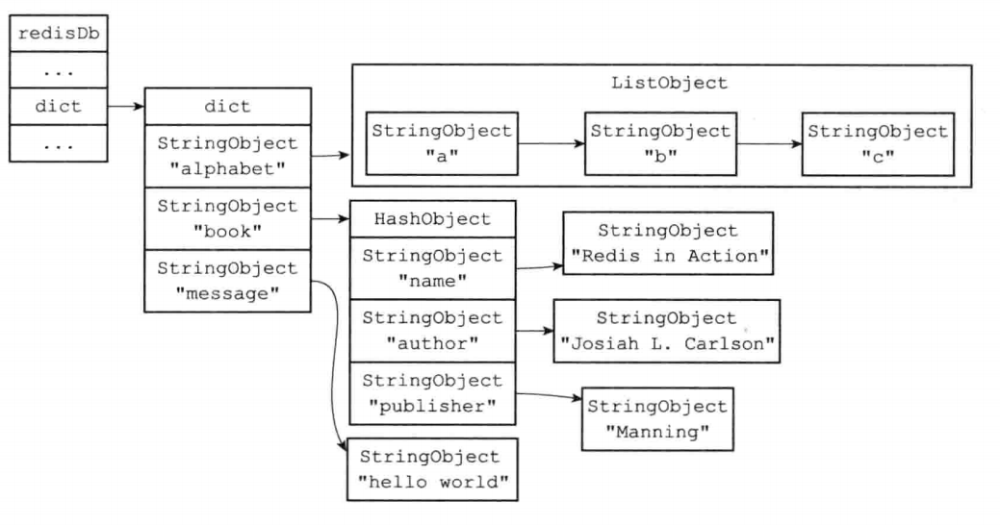

### 数据库键空间

---

每个数据库都保存两个字典，一个是键的字典，一个是过期字典。

```c
typedef struct redisDb{
    // 键字典
    dict *dict;
    // 过期字典
    dict *expires;
}
```

**键字典 ：**

键空间的键是字符串对象，即Key的名字；

键空间的值是数据库的值，即key对应的value，包括string、set、zset、list、hash。

如下图：



添加、更新、删除、查找都是通过这个字典。


**过期字典**

给key设置过期时间，会在过期字典中添加一个键值对。

键是一个指针，指向某个键对象。

值是long long类型的对象，保存了过期时间戳。【时间戳】


TTL计算的是过期时间与当前时间的差值。


过期键删除策略：

1. 定时删除 ：起多个定时任务，对cpu不友好
2. 惰性删除 ：访问到过期键才会删除，对内存不友好，如果一个过期键从不访问，那么就永远都不删除了
3. 定期删除 ：每个一段时间，就检查一次过期键，比较均衡。


Redis采用惰性删除 + 定期删除策略。


惰性删除的实现：所有读写Redis命令都会调用`expireIfNeed`函数对键进行检查。

如果已经过期，则删除；

如果没有过期，则正常的读写


**RDB对过期键的处理**

RDB会过滤掉已经过期的键。

载入时也会过滤掉已经过期的键，

但从节点不会过滤，而是等待主从同步时保证一致性。


**AOF对过期键的处理**

当执行惰性删除或者定期删除时，会显式的在AOF文件追加一个DEL命令。


AOF重写也会对过期键进行过滤，不会记录。


**主从同步对过期键的处理**

执行删除时，主节点会发送DEL命令给从节点，以保证一致性。


### 持久化

---


**RDB**

将整个数据库的状态保存到磁盘，二进制文件。

有两个命令 SAVE和BGSAVE命令，SAVE会阻塞服务器进程，期间会拒绝请求；BGSAVE则是通过fork子进程去生成RDB。

fork()会生成一个子进程，子进程和父进程共用一个内存空间，使用copyOnWrite写时复制，因此RDB保存的是某一时刻的的数据库状态。

有写操作时，会检测到内存页是只读的，这时候会异常，然后内核将内存复制了一份，父子进程各持有一个。

Redis每100ms检查一次是否需要执行RDB，Redis维护了一个dirty计数器和lastsave上次RDB的时间，用来判断是否需要执行RDB。

fork会阻塞，Redis内存越大，fork阻塞越久。

BGSAVE期间，会无视掉其他的BGSAVE和SAVE命令。


优点：

RDB恢复速度快。

占用空间小


缺点：

会丢失一部分数据。

fork可能会阻塞

cow会占用一些内存，如果BGSAVE期间很多写命令的情况。


**AOF**

AOF将执行的命令写到文件中，恢复时重放一遍就可以了。

执行完一个命令后，先写到aof缓存区，然后根据不同的策略去刷盘。

有三种刷盘：

- Always
- everysec
- no


AOF优点：

- 丢失的数据少
- 可读性高
- 可以进行AOF重写


缺点：

- 占用空间更大
- AOF速度较慢


**混合持久化**

RDB和AOF都使用，先RDB后AOF，结合了两者的优点：

- 恢复更快，丢失的数据更少

缺点是可读性差。


**AOF重写**

AOF是通过记录命令的，文件会越来越大，恢复起来也越来越慢。

比如说对一个数字incr，操作99次，但实际上通过一个set命令即可替换前面的99次INCR。


重写有两条命令：

BGREWRITEAOF和REWRITEAOF，原理和BGSAVE和SAVE类似。

BGREWRITEAOF通过fork子进程

REWRITEAOF会阻塞服务器进程。

重写会忽略已过期的键。


AOF重写缓冲区和AOF缓存区不是同一个，避免两者相互影响。

子进程AOF重写完成后，父进程会将AOF重写缓存区的内容添加到AOF文件，并将文件改名。这个期间父进程是阻塞的。


为了减少主进程的阻塞时间，引入了：

- 父子进程的**管道**，会将重写缓冲区的内容写进这个管道，以减少重写缓冲区的内容。


如果BGSAVE执行期间，客户端发起了BGREWRITEAOF命令，那么将会延迟执行BGREWRITEAOF