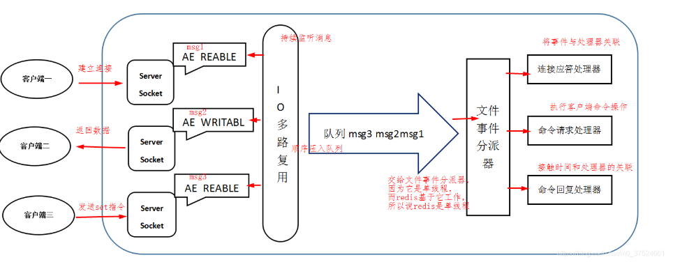
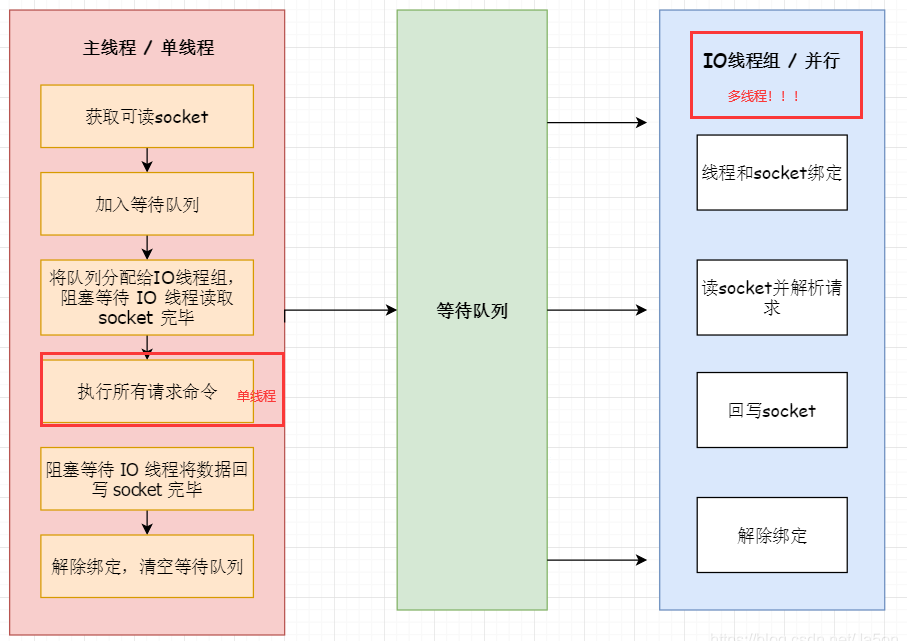
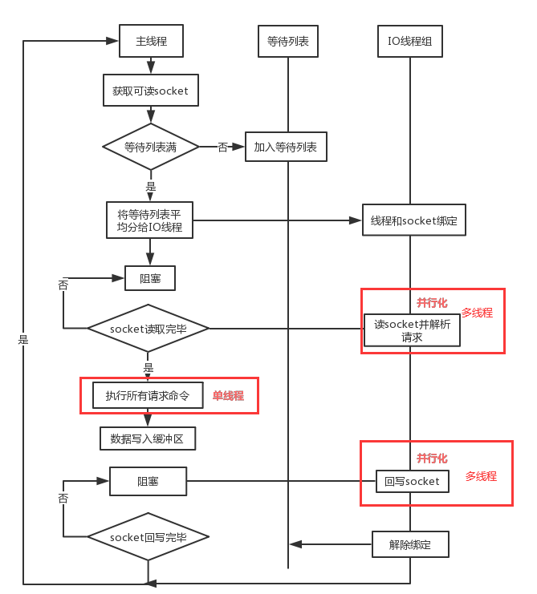

### Redis线程模型

---

Redis的的线程模型是基于单线程Reactor模型。

单线程Reactor模型只是对组件进行区分，实际上处理还是单线程的。

有以下两个缺点：

> 1. 不能充分利用多核cpu的优势
> 2. 单线程可靠性问题，如果线程死循环或者退出，那么整个通讯模块不可用。

那为什么还要使用单线程Reactor模型？

原因有以下：

- 多线程实现复杂、并且可能反而降低性能
- Redis通过IO多路复用，可以满足要求，因此没必要去用多线程

### Redis事件驱动

---

Redis服务器是事件驱动的，有两种事件：

- 文件事件 ：客户端发来的命令
- 时间事件 ：serverCron

**文件事件**

Redis通过IO多路复用监听多个套接字连接，并根据不同的事件分配不同的事件处理器。

文件事件可能并发的出现，但是Redis会把事件的套接字放入一个队列里的，通过这个套接字队列，可以让命令有序的执行。Redis保证这个队列的套接字请求是顺序执行的。

套接字的事件分为：

- AE_READABLE ：连接建立、读事件、关闭事件
- AE_WRITABLE ：连接写事件

优先读事件，再是写事件。

处理器分为 ：

- 连接应答处理器 ：
- 命令请求处理器 ：
- 命令回复处理器【AE_WRITABLE】
- 复制处理器

套接字的事件可以与处理器进行关联。

从网络连接的角度来看，一次连接、请求、回复的完整过程：

1. Redis的AE_READABLE处于监听状态下，关联连接应答处理器
2. Redis客户端发起连接，触发连接应答处理器执行，创建套接字，并将套接字的AE_READABLE与命令请求处理器想关联
3. 客户端发送命令，套接字的AE_READABLE事件与命令请求处理器相关联，接收
4. 服务器执行了命令，将套接字的AE_WRITABLE事件与命令回复处理器相关联
5. 发送完回复后，将套接字的AE_WRITABLE事件与命令回复处理结果解绑

**时间事件** ：

Redis将时间事件放到一个无序链表中，每当时间事件执行器执行时，就需要遍历，并调用响应的事件处理器。

2.6默认每10秒运行一次。

##### Redis的命令执行过程

上面从网络IO的角度来分析了一次命令是如何处理的，下面再具体分析下：

- 建立连接 ：服务端的套接字触发了AE_READABLE事件，引发连接应答处理器执行，应答

- 处理命令 ：

  - 客户端发送命令，会将命令转换为协议格式，通过套接字发给服务端

  - 服务端收到后，读取命令的参数，调用命令执行器
    - 命令执行器会 ：查找命令、验证参数、登录验证、内存检查、执行命令、写入AOF缓冲区、同步到从服务器

- 将命令发送给客户端 ：触发套接字的AE_WRITABLE相关的命令回复处理器

  

### IO模型

---

**BIO**

阻塞IO，简单来说就是一个请求一个线程，这个线程单独处理这个请求。可以使用线程池来优化。

优点 ：

充分利用了多核CPU的优势，模型简单，易于理解。

缺点 ：

读写时线程会阻塞，大量的线程会占用许多空闲的内存，线程的切换开销也很大

**单线程Reactor模型**

单线程Reactor模型，使用了IO多路复用，一个线程处理所有的事件。只是对组件进行了区分。

连接&处理步骤如下：

- Reactor接收到客户端的IO事件，如果是连接事件，分发给Acceptor用于建立连接；如果是读写事件就交给handler处理。

始终只有一个线程出处理事件请求。

缺点很明显：

- 不能充分利用多核cpu的优势
- 如果线程死循环、或者异常退出，那么整个模块都不可用

**多线程Reactor模型**

多线程Reactor模型，相比于单线程Reactor模型，不同之处在于 ：

业务处理的线程改为由多个线程，用线程池来处理。

连接&处理步骤 ：

- Reactor接收到IO事件，会处理连接事件、读写事件，业务处理则交给了线程池的线程去处理。

优点 ：

充分利用了多核cpu的优势，将业务处理与读写事件进行解耦。并且提升了可用性，某一个业务处理线程出现问题，其他的线程仍然可以正常工作。

缺点 ：

建立连接、读写都是由一个Reactor线程处理，在高并发的情况下，单线程处理连接、读写事件会是一个瓶颈。

**主从Reactor模型**

主从Reactor模型与多线程Reactor模型的不同点在于 ：

主从Reactor模型将Reactor分成了两部分 ，主Reactor只处理建立连接事件，而子Reactor处理读写事件，子Reactor有多个。业务处理仍然是使用线程池进行处理。

【Netty的线程模型 ：boss & worker】

优点 ：

将建立连接事件和读写事件进行解耦，性能、稳定性更好。

### Redis6.0之前的线程模型

---

Redis在4.0时就引入了后台线程，用于处理一些耗时的操作，如，清除大key、释放无效连接等。

使用了IO多路复用、单线程Reactor管理多个连接。cpu的速度 > 内存的速度 > 网络IO的速度，频繁的网络IO会是Redis的性能瓶颈。

一次连接的步骤 ：

1. 客户端连接服务端，产生AE_READABLE事件，触发连接应答处理器，连接应答处理器建立连接。
2. 连接建立后，服务端会将套接字的AE_READABLE事件与命令请求处理器绑定。
3. 客户端将命令包装，发送给服务端，产生AE_READABLE事件，触发命令请求处理器，读取并解析
4. 服务端分析、执行完命令后，产生AE_WRITABLE事件，触发了命令回复处理器
5. 命令回复处理器将结果写回到客户端，并解除AE_WRITABLE事件与命令回复处理器的绑定

命令执行 ：

1. 去命令字典表查到命令对应的redisCommand，redisCommand中有命令对应的函数
2. 执行预备操作 ：
   - 检查对应的redisCommand是否为空
   - 检查命令参数是否正确【redisCommand中的属性】
   - 身份校验
   - 检查内存占用，如有必要内存回收
   - ......
3. 

### Redis6.0的线程模型

---

引入了IO线程组，之前是主线程负责网络IO、命令解析、命令执行的，现在分出一个IO线程组，专门负责网络IO和命令解析，但命令执行依旧是主线程负责，依然确保了命令执行的原子性、单线程。

主线程阻塞等待socket，拿到socket分发给、绑定IO线程组，IO线程组进行读操作并解析命令，然后由主线程去执行命令，并由IO线程组去负责将结果写回，之后IO线程组才解除与socket的绑定。