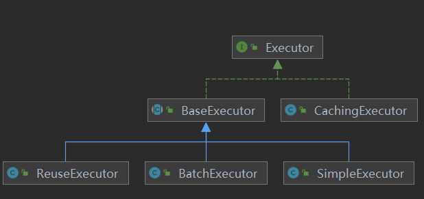

### MyBatis的核心流程

---

MyBatis的核心流程比较简单 :

1. SqlSessionFactoryBuilder读取配置文件，通过配置文件生成SqlSessionFactory

2. 通过SqlSessionFactory获取SqlSession，SqlSession的作用就是获取Mapper（即Mapper接口的代理），或者获取到MappedStatement后就执行语句了。

   - 获取Mapper

     ```java
     @Override
     public <T> T getMapper(Class<T> type) {
       return configuration.getMapper(type, this);
     }
     //实际使用
     public SysUser findDefaultUser() {
         try (SqlSession session = sessionFactory.openSession()) {
             SysUserMapper mapper = session.getMapper(SysUserMapper.class);
             return mapper.findDefaultUser();
         }
     }
     ```

   - 获取MappedStatement

     ```java
     @Override
     public <E> List<E> selectList(String statement, Object parameter, RowBounds rowBounds) {
       try {
         // 获取MapperStatement
         MappedStatement ms = configuration.getMappedStatement(statement);
         return executor.query(ms, wrapCollection(parameter), rowBounds, Executor.NO_RESULT_HANDLER);
       } catch (Exception e) {
         throw ExceptionFactory.wrapException("Error querying database.  Cause: " + e, e);
       } finally {
         ErrorContext.instance().reset();
       }
     }
     ```

3. 执行完语句，根据是否异常，执行回滚或者提交l


### 各种接口的作用

---


#### SqlSessionFactoryBuilder

见名知义，就是创建SqlSessionFactory。

通过读取配置文件，来创建SqlSessionFactory。


#### SqlSessionFactory

见名知义，就是SqlSession，最常用的方法是各种的`openSession`。

```java
SqlSession session = sqlSessionFactory.openSession()
```


#### SqlSession

主要作用有两种 ：

- 获取到Mapper接口的代理子类对象（JDK动态代理），然后手动执行，如下 ：

  ```java
  try(SqlSession session = sqlSessionFactory.openSession()){
      UserMapper userMapper = session.getMapper(UserMapper.class);
      return userMaper.selectByUsername(username);
  }
  ```

  `getMapper`底层调用的是`MapperRegistry`中的`getMapper`。

  ```java
  // org.apache.ibatis.session.defaults.DefaultSqlSession#getMapper
  public <T> T getMapper(Class<T> type) {
      return this.configuration.getMapper(type, this);
  }
  ```

  ```java
  // org.apache.ibatis.session.Configuration#getMapper
  public <T> T getMapper(Class<T> type, SqlSession sqlSession) {
    return mapperRegistry.getMapper(type, sqlSession);
  }
  ```

- 直接执行

  ```java
  try(SqlSession session = sqlSessionFactory.openSession()){
      // Mapper文件指定的namespace
      return session.selectOne("com.dzyls.UserMapper.selectByUsername",param);
  }
  ```

第二种方式需要直接写Mapper文件的Namespace，比较长，容易出错。


#### Configuration

Configuration也是在SqlSessionFactoryBuilder读取配置文件后就生成的，在XmlConfigBuilder的构造函数中创建的。


Configuration可以用来创建`ParameterHandler`、`ResultSetHandler`、`StatementHandler`、`Executor`。

```java
public ParameterHandler newParameterHandler(MappedStatement mappedStatement, Object parameterObject, BoundSql boundSql) {
  ParameterHandler parameterHandler = mappedStatement.getLang().createParameterHandler(mappedStatement, parameterObject, boundSql);
  parameterHandler = (ParameterHandler) interceptorChain.pluginAll(parameterHandler);
  return parameterHandler;
}

public ResultSetHandler newResultSetHandler(Executor executor, MappedStatement mappedStatement, RowBounds rowBounds, ParameterHandler parameterHandler,
    ResultHandler resultHandler, BoundSql boundSql) {
  ResultSetHandler resultSetHandler = new DefaultResultSetHandler(executor, mappedStatement, parameterHandler, resultHandler, boundSql, rowBounds);
  resultSetHandler = (ResultSetHandler) interceptorChain.pluginAll(resultSetHandler);
  return resultSetHandler;
}

public StatementHandler newStatementHandler(Executor executor, MappedStatement mappedStatement, Object parameterObject, RowBounds rowBounds, ResultHandler resultHandler, BoundSql boundSql) {
  StatementHandler statementHandler = new RoutingStatementHandler(executor, mappedStatement, parameterObject, rowBounds, resultHandler, boundSql);
  statementHandler = (StatementHandler) interceptorChain.pluginAll(statementHandler);
  return statementHandler;
}

public Executor newExecutor(Transaction transaction, ExecutorType executorType) {
  executorType = executorType == null ? defaultExecutorType : executorType;
  executorType = executorType == null ? ExecutorType.SIMPLE : executorType;
  Executor executor;
  if (ExecutorType.BATCH == executorType) {
    executor = new BatchExecutor(this, transaction);
  } else if (ExecutorType.REUSE == executorType) {
    executor = new ReuseExecutor(this, transaction);
  } else {
    executor = new SimpleExecutor(this, transaction);
  }
  if (cacheEnabled) {
    executor = new CachingExecutor(executor);
  }
  executor = (Executor) interceptorChain.pluginAll(executor);
  return executor;
}
```

可以看到，每次返回`ParameterHandler`、`ResultSetHandler`、`StatementHandler`、`Executor`，都会执行

`interceptorChain.pluginAll()`，这是Mybatis留给程序员的扩展点。

`ParmeterHandler` ：设置参数的Handler

`ResultSetHandler`：结果集Handler

`StatementHandler`：StatementHandler是执行Sql语句的处理器

`Executor`：Executor是执行Sql和提交\回滚操作的处理器，与一级缓存和二级缓存相关。


#### MapperRegistry

`MapperRegistry`的作用是存放MapperProxyFactory，通过MapperProxyFactory可以创建代理对象（即Mapper接口的代理子类），进而执行Mapper接口的方法。

```java
public class MapperRegistry {

  private final Configuration config;
  // knownMappers是一个Map，key是class对象，value是MapperFactoryProxy
  private final Map<Class<?>, MapperProxyFactory<?>> knownMappers = new HashMap<>();

  // 省略部分代码
    
  // 获取mapper的代理子类对象
  public <T> T getMapper(Class<T> type, SqlSession sqlSession) {
    final MapperProxyFactory<T> mapperProxyFactory = (MapperProxyFactory<T>) knownMappers.get(type);
    if (mapperProxyFactory == null) {
      throw new BindingException("Type " + type + " is not known to the MapperRegistry.");
    }
    try {
      // 容器中有的话，就直接使用反射创建Mapper对象
      return mapperProxyFactory.newInstance(sqlSession);
    } catch (Exception e) {
      throw new BindingException("Error getting mapper instance. Cause: " + e, e);
    }
  }


  public <T> void addMapper(Class<T> type) {
    if (type.isInterface()) {
      if (hasMapper(type)) {
        throw new BindingException("Type " + type + " is already known to the MapperRegistry.");
      }
      boolean loadCompleted = false;
      try {
        knownMappers.put(type, new MapperProxyFactory<>(type));
        // It's important that the type is added before the parser is run
        // otherwise the binding may automatically be attempted by the
        // mapper parser. If the type is already known, it won't try.
        MapperAnnotationBuilder parser = new MapperAnnotationBuilder(config, type);
        parser.parse();
        loadCompleted = true;
      } finally {
        if (!loadCompleted) {
          knownMappers.remove(type);
        }
      }
    }
  }

	// 省略部分代码

}

```

MapperRegistry就是一个存放MapperProxyFactory的容器，key是class对象，value是MapperProxyFactory。


MapperRegistry是SqlSessionFactoryBuilder.build方法时，就扫描加载的。

```java
  public SqlSessionFactory build(Reader reader, String environment, Properties properties) {
      ......
      XMLConfigBuilder parser = new XMLConfigBuilder(reader, environment, properties);
      return build(parser.parse());
	  ......
  }
```

```java
public Configuration parse() {
  // 解析 mybatis-config.xml
  parseConfiguration(parser.evalNode("/configuration"));
  return configuration;
}
```


#### MappedStatement

如果通过`sqlSession.selectOne()`这种方式来执行SQL语句，那么最终会调用这个方法 ：

```java
@Override
public <E> List<E> selectList(String statement, Object parameter, RowBounds rowBounds) {
  try {
    // MappedStatement
    MappedStatement ms = configuration.getMappedStatement(statement);
    // executor来执行，后面会介绍
    return executor.query(ms, wrapCollection(parameter), rowBounds, Executor.NO_RESULT_HANDLER);
  } catch (Exception e) {
    throw ExceptionFactory.wrapException("Error querying database.  Cause: " + e, e);
  } finally {
    ErrorContext.instance().reset();
  }
}
```


而configuration类的`getMappedStatement`方法 ：

```java
protected final Map<String, MappedStatement> mappedStatements = new StrictMap<MappedStatement>("Mapped Statements collection")
    .conflictMessageProducer((savedValue, targetValue) ->
        ". please check " + savedValue.getResource() + " and " + targetValue.getResource());
  public MappedStatement getMappedStatement(String id, boolean validateIncompleteStatements) {
    if (validateIncompleteStatements) {
      buildAllStatements();
    }
    return mappedStatements.get(id);
  }
```

可以看到Configuration的`mappedStatements`就是一个map，那么是什么时候将`xml`解析加载到map中的呢？

其实和MapperRegistry一样，也是`SqlSessionFactoryBuild`在读取配置文件，并build`SqlSessionFactory`就执行了加载。

```java
  private void mapperElement(XNode parent) throws Exception {
    if (parent != null) {
      for (XNode child : parent.getChildren()) {
        if ("package".equals(child.getName())) {
          String mapperPackage = child.getStringAttribute("name");
          configuration.addMappers(mapperPackage);
        } else {
          String resource = child.getStringAttribute("resource");
          String url = child.getStringAttribute("url");
          String mapperClass = child.getStringAttribute("class");
          if (resource != null && url == null && mapperClass == null) {
            ErrorContext.instance().resource(resource);
            InputStream inputStream = Resources.getResourceAsStream(resource);
            XMLMapperBuilder mapperParser = new XMLMapperBuilder(inputStream, configuration, resource, configuration.getSqlFragments());
            // 重点
            mapperParser.parse();
          } else if (resource == null && url != null && mapperClass == null) {
            ErrorContext.instance().resource(url);
            InputStream inputStream = Resources.getUrlAsStream(url);
            XMLMapperBuilder mapperParser = new XMLMapperBuilder(inputStream, configuration, url, configuration.getSqlFragments());
            mapperParser.parse();
          } else if (resource == null && url == null && mapperClass != null) {
            Class<?> mapperInterface = Resources.classForName(mapperClass);
            configuration.addMapper(mapperInterface);
          } else {
            throw new BuilderException("A mapper element may only specify a url, resource or class, but not more than one.");
          }
        }
      }
    }
  }
```

```java
public void parse() {
  if (!configuration.isResourceLoaded(resource)) {
    // 解析配置文件的mapper节点
    configurationElement(parser.evalNode("/mapper"));
    configuration.addLoadedResource(resource);
    bindMapperForNamespace();
  }

  parsePendingResultMaps();
  parsePendingCacheRefs();
  parsePendingStatements();
}
```

`bindMapperForNamespace`是根据namespace来尝试加载mapper

```java
private void bindMapperForNamespace() {
  String namespace = builderAssistant.getCurrentNamespace();
  if (namespace != null) {
    Class<?> boundType = null;
    try {
      // 根据namespace来尝试加载Mapper。如果namespace写的不是类的全限定名，就会找不到类
      boundType = Resources.classForName(namespace);
    } catch (ClassNotFoundException e) {
      // ignore, bound type is not required
    }
    if (boundType != null && !configuration.hasMapper(boundType)) {
      // Spring may not know the real resource name so we set a flag
      // to prevent loading again this resource from the mapper interface
      // look at MapperAnnotationBuilder#loadXmlResource
      configuration.addLoadedResource("namespace:" + namespace);
      configuration.addMapper(boundType);
    }
  }
}
```

而`configurationElement`则是解析xml，放到Confirguration类中的mappedStatements的map容器中。

```java
private void configurationElement(XNode context) {
  try {
    String namespace = context.getStringAttribute("namespace");
    if (namespace == null || namespace.isEmpty()) {
      throw new BuilderException("Mapper's namespace cannot be empty");
    }
    builderAssistant.setCurrentNamespace(namespace);
    cacheRefElement(context.evalNode("cache-ref"));
    cacheElement(context.evalNode("cache"));
    parameterMapElement(context.evalNodes("/mapper/parameterMap"));
    resultMapElements(context.evalNodes("/mapper/resultMap"));
    sqlElement(context.evalNodes("/mapper/sql"));
    buildStatementFromContext(context.evalNodes("select|insert|update|delete"));
  } catch (Exception e) {
    throw new BuilderException("Error parsing Mapper XML. The XML location is '" + resource + "'. Cause: " + e, e);
  }
}
```


#### Executor

Executor是执行SQL语句的接口 ，创建Executor的方法就在Confirguation ：

`org.apache.ibatis.session.Configuration#newExecutor`

```java
public Executor newExecutor(Transaction transaction, ExecutorType executorType) {
  executorType = executorType == null ? defaultExecutorType : executorType;
  executorType = executorType == null ? ExecutorType.SIMPLE : executorType;
  Executor executor;
  // 默认为SimpleExecutor
  if (ExecutorType.BATCH == executorType) {
    executor = new BatchExecutor(this, transaction);
  } else if (ExecutorType.REUSE == executorType) {
    executor = new ReuseExecutor(this, transaction);
  } else {
    executor = new SimpleExecutor(this, transaction);
  }
  // 如果打开了二级缓存，则会创建CachingExecutor
  if (cacheEnabled) {
    executor = new CachingExecutor(executor);
  }
  executor = (Executor) interceptorChain.pluginAll(executor);
  return executor;
}
```


> MyBatis的一级缓存作用域是整个SqlSession，本质上是一个HashMap，key是将查询语句封装的CacheKey，如果是多个SqlSession或分布式的情况下，一级缓存会有脏数据的情况发生。
>
> 二级缓存的作用域则是namespace，如果一张表有两个不同的namespace进行操作，那么一定不要使用二级缓存，否则会出现缓存一致性问题。

关于MyBatis的一级缓存和二级缓存放在下个章节讨论。


Executor的实现类 ：



BaseExecutor中实现了一些通用操作，其子类可以直接使用（**模板模式**）。

ReuseExecutor是重用执行器，它会将Statement缓存起来，sql为key，这样就免去重复创建Statement。

每个Executor都有两个`PerpetualCache`类型的属性 :

```java
public abstract class BaseExecutor implements Executor {

  protected Transaction transaction;

  protected PerpetualCache localCache;
  protected PerpetualCache localOutputParameterCache;
  protected Configuration configuration;
```

正是这localCache就是实现一级缓存的关键，这个类型含有一个HashMap。


CachingExecutor则是一个包装类（**装饰器模式**），构造参数是`Executor`，在执行真正的操作前，会做一些操作来实现，然后才调用真正的Executor来执行语句。

```java
// 真正的执行器
private final Executor delegate;

// 构造函数
public CachingExecutor(Executor delegate) {
  this.delegate = delegate;
  delegate.setExecutorWrapper(this);
}


@Override
public int update(MappedStatement ms, Object parameterObject) throws SQLException {
  // 清空二级缓存
  flushCacheIfRequired(ms);
  return delegate.update(ms, parameterObject);
}
```

CachingExecutor中有二级缓存，是以**namespace**为作用域的。


Executor执行sql语句时，底层是调用jdbc的方式来执行语句。

回顾一下常规的jdbc查询操作：

```java
			// 注册 JDBC 驱动
            Class.forName(JDBC_DRIVER);        
            // 打开链接
            conn = DriverManager.getConnection(DB_URL,USER,PASS);       
            // 执行查询
            stmt = conn.createStatement();
            String sql = "SELECT id, name, url FROM websites";
            ResultSet rs = stmt.executeQuery(sql);
 			// 省略结果处理、关闭资源等操作
```

举例 `org.apache.ibatis.executor.SimpleExecutor#doUpdate` ：

```java
@Override
public int doUpdate(MappedStatement ms, Object parameter) throws SQLException {
  Statement stmt = null;
  try {
    Configuration configuration = ms.getConfiguration();
    // 创建StatementHandler
    StatementHandler handler = configuration.newStatementHandler(this, ms, parameter, RowBounds.DEFAULT, null, null);
    stmt = prepareStatement(handler, ms.getStatementLog());
    // Statementhandler就是来处理Statement的，用来执行语句
    return handler.update(stmt);
  } finally {
    closeStatement(stmt);
  }
}
```


`org.apache.ibatis.executor.statement.PreparedStatementHandler#update`

```java
@Override
public int update(Statement statement) throws SQLException {
  PreparedStatement ps = (PreparedStatement) statement;
  ps.execute();
  int rows = ps.getUpdateCount();
  Object parameterObject = boundSql.getParameterObject();
  KeyGenerator keyGenerator = mappedStatement.getKeyGenerator();
  keyGenerator.processAfter(executor, mappedStatement, ps, parameterObject);
  return rows;
}
```

底层还是调用了`stateMent.execute()`。

**这种是不经过JDK代理的，通过`sqlSession.selectList()`这种方式来调用的**

#### MapperProxy & MapperMethod

如果是通过`sqlSession.getMapper()`这种方式来调用的呢？

原理大致如下 ：

```java
public class InvocationHandlerTest {

    public static void main(String[] args) {
        Cat cat = (Cat)Proxy.newProxyInstance(Cat.class.getClassLoader(), new Class[]{Cat.class} , new CatHandler());
        cat.eat();
    }

}
// InvocationHandler，真正执行的是这里！
class CatHandler implements InvocationHandler{
    @Override
    public Object invoke(Object proxy, Method method, Object[] args) throws Throwable {
        System.out.println("Abc");
        return null;
    }
}

interface Cat{
    void eat();
}
```

就是JDK动态代理Mapper接口，等到真正调用Mapper接口中的方法时，再InvocationHandler偷天换日，调用`sqlSession`来调用执行语句。

Configuration中有一个MapperRegisty。

MapperRegistry有个HashMap，HashMap的key是Dao接口的class，value是MapperProxyFactory。

MapperProxyFactory是用来创建MapperProxy，即Mapper接口的代理类的，`sqlSession.getMapper()`返回的就是这个MapperProxy代理类。当执行Mapper接口的方法时，这个代理类会调用`sqlSession`中的方法。根据增删改查的不同来调用不同的方法。

`sqlSession`中有一个MappedStatements的Hashmap，key是 namespace + id（因此namespace如果乱写，对不上Mapper接口的全限定名就会有问题），value就是MappedStatement，MappedStatement就是解析后的sql语句。然后就继续调用Executor来执行sql语句。


`org.apache.ibatis.session.Configuration#getMapper`

```java
protected final MapperRegistry mapperRegistry = new MapperRegistry(this);
public <T> T getMapper(Class<T> type, SqlSession sqlSession) {
  return mapperRegistry.getMapper(type, sqlSession);
}

public MapperRegistry getMapperRegistry() {
  return mapperRegistry;
}
```


```java
public class MapperRegistry {

  private final Configuration config;
    // knownMapper是在扫描Mappper.xml文件时，根据namespace来classForName判断类是否存在，如果存在就放进缓存中
  private final Map<Class<?>, MapperProxyFactory<?>> knownMappers = new HashMap<>();

  public MapperRegistry(Configuration config) {
    this.config = config;
  }

  @SuppressWarnings("unchecked")
  public <T> T getMapper(Class<T> type, SqlSession sqlSession) {
    final MapperProxyFactory<T> mapperProxyFactory = (MapperProxyFactory<T>) knownMappers.get(type);
    if (mapperProxyFactory == null) {
      throw new BindingException("Type " + type + " is not known to the MapperRegistry.");
    }
    try {
      return mapperProxyFactory.newInstance(sqlSession);
    } catch (Exception e) {
      throw new BindingException("Error getting mapper instance. Cause: " + e, e);
    }
  }
    // 省略部分方法
}
```

`org.apache.ibatis.binding.MapperProxyFactory#newInstance()`

```java
protected T newInstance(MapperProxy<T> mapperProxy) {
    // 返回的是一个代理类，真正执行的是mapperProxy
  return (T) Proxy.newProxyInstance(mapperInterface.getClassLoader(), new Class[] { mapperInterface }, mapperProxy);
}

public T newInstance(SqlSession sqlSession) {
  final MapperProxy<T> mapperProxy = new MapperProxy<T>(sqlSession, mapperInterface, methodCache);
  return newInstance(mapperProxy);
}
```

执行Mapper接口中的方法，实际上是执行MapperProxy中的invoke方法，而这个invoke方法

```java
@Override
public Object invoke(Object proxy, Method method, Object[] args) throws Throwable {
  if (Object.class.equals(method.getDeclaringClass())) {
    try {
      return method.invoke(this, args);
    } catch (Throwable t) {
      throw ExceptionUtil.unwrapThrowable(t);
    }
  }
  final MapperMethod mapperMethod = cachedMapperMethod(method);
    // 实际上会执行mapperMethod的execute
  return mapperMethod.execute(sqlSession, args);
}
```

`org.apache.ibatis.binding.MapperMethod#execute`

```java
public Object execute(SqlSession sqlSession, Object[] args) {
  Object result;
  switch (command.getType()) {
    case INSERT: {
   Object param = method.convertArgsToSqlCommandParam(args);
        // 重点来了，最终还是执行sqlSession的insert方法
      result = rowCountResult(sqlSession.insert(command.getName(), param));
      break;
    }
    case UPDATE: 
    
    // 省略其他方法
  }
    //....
  return result;
}
```


MapperRegisty中有一个Map，key是Mapper接口的class，vlaue是MapperProxyFactory。MapperProxyFactory可以用来创建MapperProxy（JDK动态代理），也就是Mapper接口的代理类。通过`SqlSession.getMapper()`，最终会调用`MapperRegisty.getMapper()`，会从Map中取出MapperProxyFactory对象并创建一个接口代理类。等到真正调用Mapper接口方法的时候，其实是执行MapperProxy的invoke方法，最终还是调用`sqlSession`的增删改查方法。


#### 一级缓存和二级缓存

一级缓存使用的是BaseExecutor（子类有SimpleExecutor、ReuseExecutor、BatchExecutor），有一个属性是localCache，这个localCache就是把Map封装了。

```java
public class PerpetualCache implements Cache {

  private final String id;

  private final Map<Object, Object> cache = new HashMap<>();
}
```

共用父类，因此三个子类都会使用到。这个Map就是一级缓存，作用域是`sqlSession`。

如果要关闭一级缓存，可以

- 设置`localCacheScope`为`statement`级别。

- 查询语句加randomString = randomString
- mapper.xml配置该sql的statement为`flushCache=true`


二级缓存默认是关闭的，一般不打开。打开方式为，设置`cacheEnabled`为`true`

原因是，二级缓存的作用域是`namespace`，如果有两个`namespace`操作了同一张表，那么是有可能出现脏数据的，因此通常都不打开二级缓存。

二级缓存的实现，是利用了装饰器模式，使用了CachingExecutor来包装其他的Executor。

```java
public Executor newExecutor(Transaction transaction, ExecutorType executorType) {
  executorType = executorType == null ? defaultExecutorType : executorType;
  executorType = executorType == null ? ExecutorType.SIMPLE : executorType;
  Executor executor;
  if (ExecutorType.BATCH == executorType) {
    executor = new BatchExecutor(this, transaction);
  } else if (ExecutorType.REUSE == executorType) {
    executor = new ReuseExecutor(this, transaction);
  } else {
    executor = new SimpleExecutor(this, transaction);
  }
    // CachingExecutor包装类
  if (cacheEnabled) {
    executor = new CachingExecutor(executor);
  }
  executor = (Executor) interceptorChain.pluginAll(executor);
  return executor;
}
```


由于MyBatis的缓存都是本地的，分布式环境大概率出现不一致。生产环境通常关掉，而是使用Redis这种分布式缓存，可控性更高。

### MyBatis标签

---

除了`select`、`delete`、`update`、`insert`，MyBatis的标签还有 ：

1. **动态标签**

   - choose
   - when
   - foreach
   - if
   - trim
   - where
   - set
   - otherwise
   - bind

   动态标签的实现原理是，通过OGNL从SQL参数中计算表达式的值，根据计算的值动态拼接SQL

2. sql片段

   - sql
   - resultMap，解析到Configuration类中放到resultMaps
   - parameterMap，解析到Configuration放到parameterMaps
   - include
   - assoiciation
   - collection


select 、update、delete、insert会被解析为MappedStatement对象，sql会解析为BoundSql对象。

因此，如果想要拿到sql，调用方式为 ：

```java
sqlSession.getConfiguration().getMappedStatement(sqlId).getSqlSource().getBoundSql().getSql();
```


### MyBatis插件原理

---

MyBatis插件的原理是，在Configuration执行创建`paramterHandler`、`resultSetHandler`、`statementHandler`、`Executor`之后，在返回之前，会执行拦截器链。

因此做一个MyBatis插件，就需要实现MyBatis的`Inteceptor`接口。

如果要修改sql语句，就需要使用反射来修改。


```java
@Intercepts({@Signature(method = "prepare", type = StatementHandler.class,
        args = {Connection.class, Integer.class})})
public class ShardPlugin implements Interceptor {
    
}
```


### TypeHandler

---

MyBatis可以做一些类型转换，实现TypeHandler即可。

```java
public interface TypeHandler<T> {

  void setParameter(PreparedStatement ps, int i, T parameter, JdbcType jdbcType) throws SQLException;

  T getResult(ResultSet rs, String columnName) throws SQLException;

  T getResult(ResultSet rs, int columnIndex) throws SQLException;

  T getResult(CallableStatement cs, int columnIndex) throws SQLException;

}
```

如 ，实现一个枚举类的TypeHandler ：

```java
public enum SexEnum {

    MALE(1, "男"), FEMALE(0, "女");
    private int id;
    private String name;

    SexEnum(int id, String name) {
        this.id = id;
        this.name = name;
    }

    public static SexEnum getSexById(int id) {
        for (SexEnum sex : SexEnum.values()) {
            if (sex.getId() == id) {
                return sex;
            }
        }
        return null;
    }
 	// 省略get、set   
}
```

```java
@MappedTypes(SexEnum.class)
@MappedJdbcTypes(JdbcType.INTEGER)
public class SexEnumTypeHandler implements TypeHandler<SexEnum> {

    // 设置参数的方法，i为参数的位置
    @Override
    public void setParameter(PreparedStatement ps, int i, SexEnum parameter, JdbcType jdbcType) throws SQLException {
        ps.setInt(i, parameter.getId());
    }

    @Override
    public SexEnum getResult(ResultSet rs, String columnName) throws SQLException {
        // 设置对象属性
        int id = rs.getInt(columnName);
        return SexEnum.getSexById(id);
    }

    @Override
    public SexEnum getResult(ResultSet rs, int columnIndex) throws SQLException {
        int id = rs.getInt(columnIndex);
        // 返回值设置对象属性
        return SexEnum.getSexById(id);
    }

    @Override
    public SexEnum getResult(CallableStatement cs, int columnIndex) throws SQLException {
        int id = cs.getInt(columnIndex);
        // 返回值设置对象属性
        return SexEnum.getSexById(id);
    }
}
```


### 延迟加载

---

MyBatis支持延迟加载，它的原理是 ：

CGLIB创建代理对象，当真正要使用到属性时，拦截器发现属性是空的，那么就会执行SQL，查到属性并设置进去。

`lazyLoadingEnabled=true`


### 一对一和一对多

---

