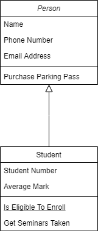
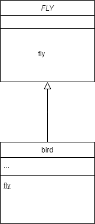
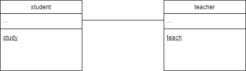
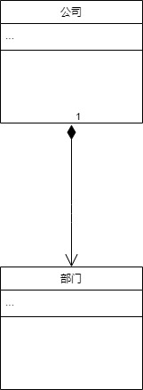
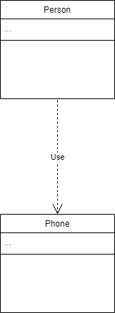

UML类图中有很多箭头，种类还是比较多的，难以记忆。

这里总结了几种关系，以及对应的箭头。

- 泛化

泛化可以简单理解为继承，使用空心的三角箭头+实线。

- 实现

实现是类与接口的关系，与泛化不同的是，实现是空心的三角箭头+虚线。

- 关联

关联的关系，比如老师和学生的关联关系。

需要注意的是，如果关系是双向的，使用双向箭头或者不使用箭头。

如果关系是单向的，则使用单向箭头。

- 聚合

聚合关系，表达的是整体与部分的关系。如手机和屏幕的关系。

- 组合

组合关系，描述的也是整体与部分的关系。但是与聚合关系不同的是，组合关系中部分不能离开整体。

- 依赖

依赖关系，则是使用虚线。

