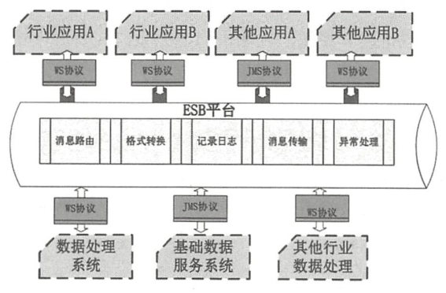
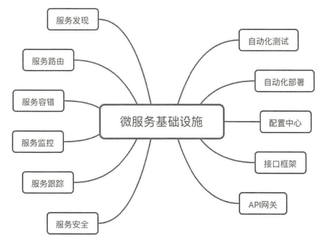

## 为什么需要可扩展性

软件是需要可扩展的，因为会有新的需求。这点与建筑不同，一座建筑建成，几乎不会再对结构做大的改动，只会是一些修缮。而软件不同，软件不仅是做修缮，还会有更新迭代、添加新的功能、修复发现的bug。可扩展性带来的好处是，添加新功能或修复bug时，要修改的地方较少。

在软件设计之初，就需要考虑软件的可扩展性，否则对软件进行扩展时，将会是极大的折磨。

笔者在刚毕业时，曾经参与一个爬虫项目的开发，在开发前期，添加一个网站的爬虫，居然要改动二十几个类，新手的学习成本也很高，改的也很痛苦。

## 如何做可扩展

可扩展性，就一字秘诀 ：**拆**。

这里说的拆，不是拆迁的那种拆，推到全部重来。而是对一个大的系统做拆分，比如一个购物网站，从功能上可以分为登录、支付、仓储、物流等等模块；从服务上来分，可以分为显示层、业务层、数据层、存储层等。

但也并非所有情况都要做拆分，比如一个项目就一个开发人员，并且日后不会有大的需求变更，这种就不用拆分为多个模块，做一个大而全的模块即可。

拆，可以分为多种思路 ：

- 根据流程拆分 ：将整个业务流程分为多个流程
- 根据服务拆分 ：将系统提供的服务拆分，每个服务作为一个功能
- 根据功能拆分 ：将一个系统的功能拆分，每个功能作为一部分

如常见的小系统根据流程拆分可以分为 ：

1. 显示层
2. 业务层
3. 数据层
4. 存储层

在流程拆分的基础上，进行服务拆分 ：

1. 注册服务
2. 登录服务
3. 信息管理
4. 。。。

对服务进行拆分后，可以做更低粒度的功能拆分 ：

- 如注册服务，可以拆分为手机号注册、邮箱注册
- 登录服务可以拆分为验证码登录、密码登录
- 。。。

## 系统架构

根据不同的拆分方式，可以得到不同的系统架构 ：

- 从流程拆分  ：分层架构
- 从服务拆分 ：SOA、微服务
- 从功能拆分 ：微内核架构

这些流程并非是非此即彼的，也可以互相融合 ，如：

登录服务可以分为验证码登录和密码登录功能。

## 分层架构

分层架构，很好理解，即分为多个层。

如常见的根据职责去划分 ：MVC架构、MVP架构。

根据用户交互方式划分 ：B/S、C/S架构。

分层的边界要明显，否则两个分层差异不大的话，会出现即可以放在A层，又可以放在B层的情况，这种就失去了分层的意义。

分层架构的优点是，扩展的时候大部分时候只需要修改一层即可。

缺点是性能问题，层层调用，性能会较差。

## SOA

面向服务的架构。

背景 ：

- 如一个员工的入职离职，可能要涉及到人力资源系统、财务系统、销售系统，如果不做SOA，需要分别操作三个系统，这样十分麻烦。
- 不同的系统使用不同的语言、技术栈，一些流程需要调用多个系统，每次开发新的流程和业务，都需要协调大量的系统。

SOA提出了三个概念 ：

- 所有的业务都是一项**服务**
- **ESB** ：企业服务总线，参考了计算机总线的概念。SOA使用ESB来屏蔽不同系统的不同的接口方式，通过ESB即可调用。相当于一个中介。
- 松耦合 ：减少各个服务之间的依赖关系。很难做到，因为一个服务可能有多个调用者，不可能所有人都跟着你改，只能做好 **向后兼容**

优点 ：**解决了传统IT系统的重复建设、扩展效率低的问题**

缺点 ：引入ESB，导致系统更复杂了，并且ESB要涉及到消息路由、数据转换、协议转换，本身是消耗大量性能的，很可能成为整个系统的瓶颈。

## 微服务架构

微服务架构听起来很像SOA架构，但还是有区别的 ：

- 划分粒度，SOA的粒度更大，微服务更小
- 消息通信，微服务一般采用HTTP，没有ESB
- 应用场景 ：SOA应用于整合大型企业系统；微服务则是更轻量级、通过HTTP、适合互联网

**微服务的缺点**

- 划分的粒度太小 ：如果划分的粒度太小，就会导致**服务调用链路过长**，效率极其低下，并且难以排查链路上的问题。还有一个是，开发人员的个数，比如说有五个开发人员，划分了30个微服务，每个人负责多个微服务，这种真的特别麻烦，不如先划分的粒度大一点，等业务的规模上去了，再对原有粒度再次细分。
- 微服务带来的另外一个困难是 ：运维的成本也很高，如果没有自动化运维，那么就很难达成快速交付的目的。并且服务多了，也难以治理。如何路由、新增的节点如何发现、某个节点故障如何故障隔离。

**微服务拆分的原则**

- 三个火枪手原则 ：在开发期间，三个人维护一个系统是比较合适的，有备份；维护期间，一个人就足够了。

**拆分方法**

1. 基于业务逻辑拆分 ：首先基于三个火枪手原则去计算大概的服务数量，然后确定合适的职责范围；后续业务量增加，再做更细粒度的划分。
2. 基于可扩展性拆分 
3. 基于可靠性拆分

**微服务基础设施**

微服务需要搭配上基础设施才能发挥出威力 ：

## 微内核

又名插件化架构，根据需要去下载插件。

比如IDEA下载插件。

**微内核的关键点**

微内核有三个关键技术 ：

- 插件管理 ：核心系统需要知道有哪些插件、什么时候加载、是否需要加载、怎么加载
- 插件连接 ：插件如何连接到核心系统·
- 插件通信 ：插件之间如何通信，核心系统需要提供一套规范，用于插件之间的通信。

OSGI标准是常用的插件化标准。