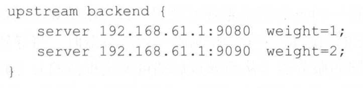
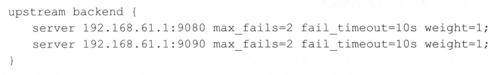
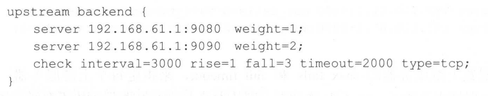
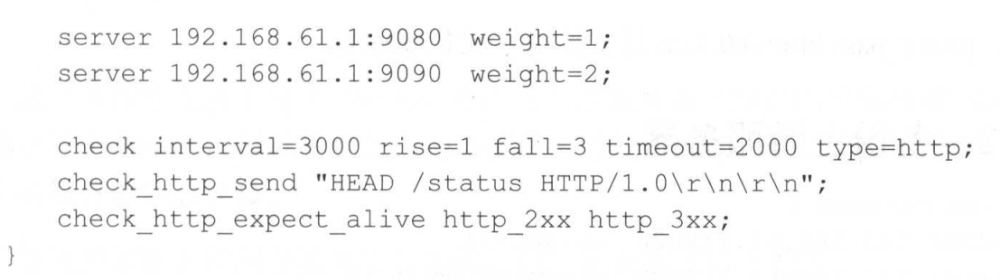

## 负载均衡

软负载均衡有LVS，硬服务均衡有F5。

但是对于开发来讲，了解Nginx的负载均衡即可。

nginx的负载均衡配置比较简单

### Nginx负载均衡算法

---

nginx有两种 ：

- round-robin  ：根据权重轮询
- ip_hash ：根据IP进行哈希

此外，nginx商业版支持最短响应时间负载均衡。

### 失败重试

---

通过max_fails指定最大失败次数，fail_timeout指定失败时间。如果达到失败的判定标准，则摘除这个服务器。

### 健康检查

---

nginx支持TCP和HTTP心跳检查。

**TCP心跳检查**

**HTTP心跳检查**	

check_http_send  ： 发送的HTTP内容

check_http_expect_alive ：认为应用存活的HTTP状态码

