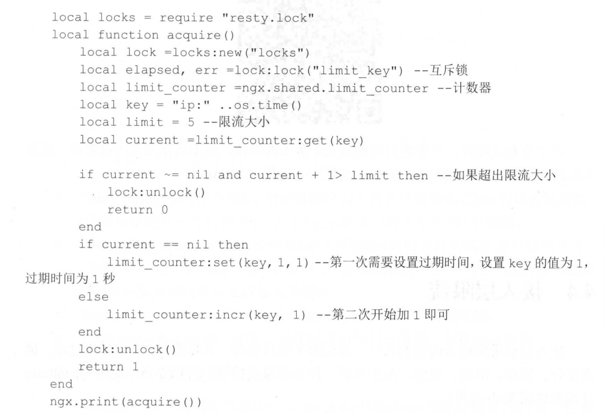

# 限流

限流是通过对并发访问/请求，进行限速来保护系统。

秒杀的场景下，限流也可避免无效的处理。

在压测时，找到每个系统的峰值，然后通过设定阈值，来限制流量达到保护系统的目的。

也可以根据系统的响应时间、吞吐量来动态的调整阈值。

## 常见的限流手段

**Nginx的limit_conn模块**

用来限制瞬间并发数

**RateLimiter**

限制单位时间内的平均速率。

**Nginx的limit_req**

限制单位时间内的平均速率

## 限流算法

限流算法常见的有 ：

### 令牌桶限流

---

往一个桶内放入令牌，请求到达时，去桶中拿令牌，如果令牌数量不足，则要等待。

### 漏桶限流

---

请求的数量放入一个漏桶中，漏桶以恒定的数量丢弃，如果漏桶的空间不足以存放请求的数量，则丢弃。

令牌桶可以应对突发的流量，漏桶则比较平滑。

## 应用级限流

在应用中，使用限流，可以通过以下步骤 ：

### 线程池来限流

---

通过设定线程池的核心线程数和等待队列，可以保证不会超出应用的极限。

### 信号量限制接口

---

通过Java的信号量，每次请求时，先去请求信号量，如果信号量不足则阻塞或异常，这样也能保证接口的不被过度调用。

### Guava的Cache来做窗口限流

---

Guava的Cache，可以做窗口限流，Key为时间，Value为请求数，如果每秒请求数达到了一定数量，则进行限流。固定窗口有个问题是，临界问题。

使用滑动窗口可以解决。

### RateLimiter

---

Guava提供了RateLimiter，使用令牌桶算法来实现，可以平滑限流、应对突发流量。

## 分布式限流

有些应用场景需要做分布式限流，比如对同一个用户进行营销推送，如果不加以限制，可能出现同一个用户收到过多的推送。

### Redis + Lua

---

Redis可以执行Lua脚本，并且是原子执行。

通过对Lua脚本编写一个计数器，来实现限流。

### Nginx + Lua

---

Nginx也可编写Lua脚本来实现限流，实际的情况还需要确保命令是原子性的，使用互斥锁。

### 对比

---

虽然接入层【Nginx】做限流更好，但实际情况中使用Redis + Lua脚本更多。

Redis + Lua，会有一个网络请求的时间，因此比本地的信号量或RateLimiter要慢很多。使用Lua脚本，也要避免Lua脚本执行时间过长，导致其他命令被阻塞的太久。

## 节流

Throttle，节流，防止多个相同的事件连续重复执行。

如，搜索框的建议，一般只处理最后一个。

前端可使用，jq的框架，throttle.

