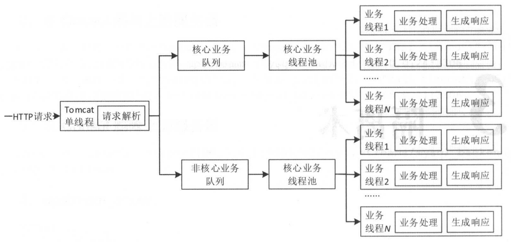

# 为什么做隔离

隔离主要的目的是，当某一个服务出现异常，不会因为调用它而故障，避免服务雪崩。

常用的隔离手段，有 ：

### 线程隔离

---

线程池隔离，不同线程池处理不同的请求。避免故障扩散到其他线程池。

### 进程隔离

---

只有一个进程时，当某个模块出问题时，就会导致整个服务不可用。比如，某个模块代码有内存泄露导致内存溢出整个服务不可用。

进程隔离是一个过渡的方案，更好的方案是，拆分成多个子系统。

### 集群隔离

---

集群隔离是对进程隔离的升级，对服务进行分组，当某一组的服务出现问题，不影响其他组的服务。

### 机房隔离

---

大型网站的部署，跨机房部署是很常见的，每个机房都有自己的服务分组，机房之间不进行跨机房的调用。一个机房发生问题时，通过DNS/负载均衡将请求全部切到另外正常的机房。

### 读写隔离

---

将服务进行读写分离，如Redis的主从集群，当主机群出现问题时，从机还是可以提供读服务的，这样就确保了读服务的高可用。优先从从机进行读取，能降低主机的压力。

### 动静分离

---

避免静态资源的请求占用了机房的带宽，导致动态的请求被挤占，使用CDN可以实现动静分离。

### 爬虫隔离

---

对爬虫进行隔离，爬虫频繁的请求，会导致正常的请求无法被处理。因此要对爬虫进行隔离。

可以通过负载均衡将异常流量转发到单独的集群。

Nginx + OpenResty，可以实现对爬虫的user-agent进行过滤，还可以过滤一些恶意的IP，将他们分发到固定的分组。这种情况存在一定的误杀。

实际情况中，可以IP + Cookie的方式，如果没有Cookie则分流到固定的分组。

### 热点隔离

---

如果某个功能是热点，可以做成单独的系统，比如秒杀、抢购这种，即使挂掉也不影响其他服务。

### 资源隔离

---

磁盘、内存、网络、CPU，这些资源，都会存在竞争的问题。

比如，某个应用的镜像写特别频繁，可以考虑对这个Docker镜像挂载SSD硬盘。

还有，默认的CPU调度策略可能并不适合某些场景，比如Redis实例，通过taskset命令指定cpu给Redis可以提升一些性能。

Nginx也有worker_processes来指定cpu。

> JRockit 也可以指定Cpu。

还有带宽隔离，大数据集群在计算时，会占用很大的带宽，因此大数据集群要和应用集群隔离开。

还有环境隔离 ：测试环境、预发布环境、生产环境

AB测试，

缓存隔离 ：不同系统使用不同的Redis

