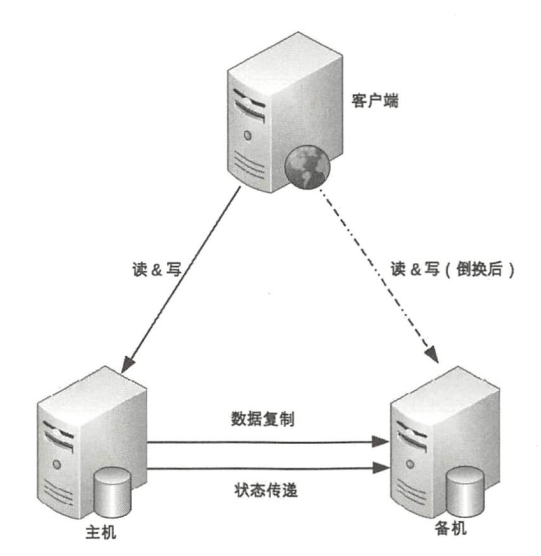
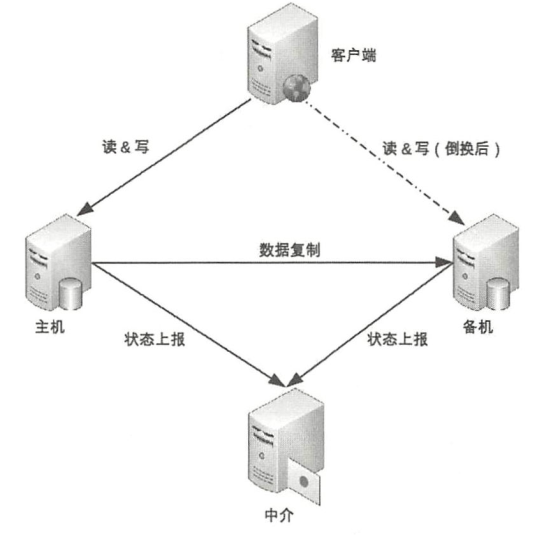
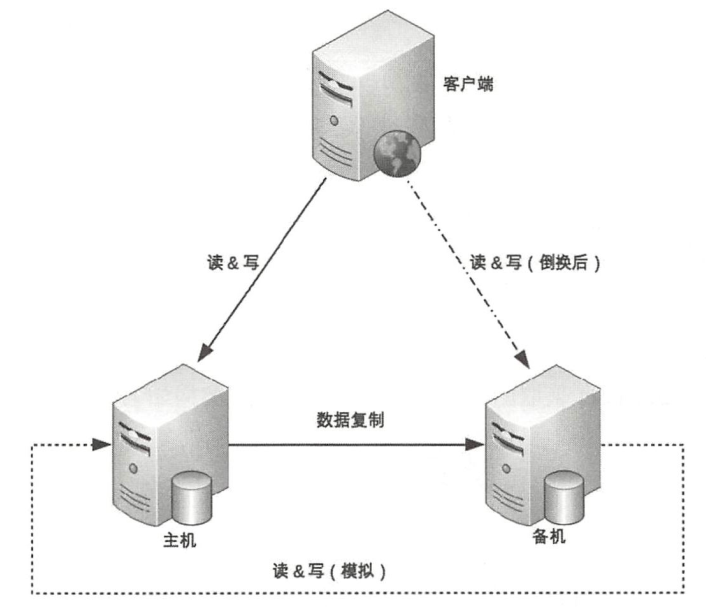
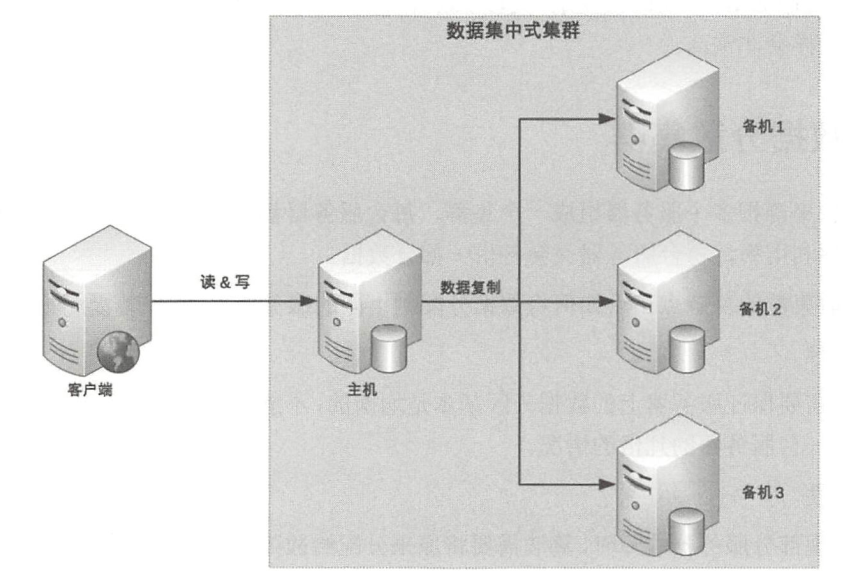

## 复制

存储高可用的方案，都是通过复制来实现的。如何复制、故障转移、复制延迟等问题是高可用解决方案需要思考的。

**高可用不包括一致性**，如Redis哨兵模式是高可用的，但是主从切换时可能会丢数据。

**高可用不同于鲁棒性**，鲁棒性指的是系统的健壮性【耐操】，应对的是参数错误、磁盘故障、网络过载等情况下系统能否不崩溃；而高可用性是针对于集群而言，集群中某个节点挂掉，不影响整个集群的运作。

### 主备复制

---

主备复制 ：主节点用于读写，并将数据复制到备用节点。

备用节点只是用于备用，如果主节点正常运作，那么备用节点就只是复制数据。如果主机故障，那么系统则不可用；需要人工将备份节点升级为主机。

**优点** ：简单。

**缺点** ：

- 备用节点只是用来备份，浪费机器性能
- 主节点故障时，需要人工操作才能故障转移，这个期间系统是不可用的，比较麻烦。
- 主备复制有延迟，如果延迟比较大，那么可能会丢数据。

适用于 ：各种管理系统，很少对数据做改动。

### 主从复制

---

主从复制 ：主节点用来写或者读，从节点用来读，主节点将数据复制到从节点。

如果主节点宕机，那么系统无法进行写操作，但是可以进行读操作。如果搭配主从切换，则切换更简单。

主从复制存在延迟，可能会出现不一致的情况，如刚发布一个状态就去从库读，可能读不到。应对方法是，

- 写后立刻读，去主库去读。
- 对复制延迟监控，如果延迟大于某个阈值，则提醒人工干预。

**优点** ：充分利用了从节点的性能，避免闲置。

**缺点** ：

- 主从切换需要人工干预

适用于 ：论坛这种情景，写少读多的情况。

### 主主复制

---

都是主节点，互相将自己的数据复制给对方，不用考虑主从切换的事情。客户端轮询去访问就可以了，一个不行就换一个。

主主复制看上去比较简单，但是也要很多缺点 ：

- 数据需要双向复制，互为主从。当有两个主节点还比较好理解，但如果是三个以上的节点呢？每个节点都需要把自己的数据复制给其他节点，这也是一种性能损耗。
- ID怎么设置？如果是自增的，那么可能会出现两个节点同时插入，产生的ID是相同的，因此会冲突。可能要使用雪花ID来避免。但是这样又增加了系统复杂度

## 复制的架构

复制的方式有多种，复制的架构也有不同种类。

### 互联式

---

主从连接，加一个状态通道，用于双方感知状态。

状态的感知，可以是一个网络连接，也可以是个接口【如F5调用HTTP探测进程是否存活】，也可以是发送命令【如哨兵模式会定时向Master节点发送INFO命令探测状态】

缺点也很明显：

- 如果只是网络波动导致状态传递暂时不可用，那么双方可能会产生误判。如，备机无法感知到主机的状态，是切换为主机还是不切换呢？如果切换，网络恢复，就会有两个主机，产生脑裂的现象。

### 中介式

---

使用一个中介来探测双方的状态【如哨兵模式】

中介式比较简单，使用一个中介去感知双方的状态。

这种应用很多，比如哨兵、zookeeper。

使用中介式架构，有以下优点：

- 状态维护比较简单
- 可以避免脑裂的情况，比如由于网络波动导致主机无法连接到zookeeper，zookeeper告知备机升级为主机，当原主机恢复网络连接时，变为备机的身份。而且zookeeper使用ZAB协议，当集群中不可用服务过半时，服务将不可用，以此避免了脑裂。

> Redis哨兵模式也是中介式，但哨兵模式避免脑裂的做法是通过配置 ：
>
> - min-slaves-to-write ：当与主机连接的备机数目小于这个数字时，主机将拒绝写，读仍然可用
> - min-slaves-max-lag ：当主从复制的延迟大于这个数字，主机也会拒绝写
>
> 由此来尽量保证数据不丢失、集群不脑裂。

但缺点也很明显 ：

- 需要维护一个中介的集群，中介也要保证高可用【zookeeper集群、哨兵集群】，成本高

 ### 模拟式

---

备机模拟为一个客户端，定时去访问主机。这种类似于互联式，但又有不同，模拟式是单向访问，互联式是双向的。

缺点和互联式一样，很明显 ：

- 当网络临时波动，会造成备机误判，错误的升为主机，导致**脑裂**

## 数据集群架构

数据集群架构的也有不同，可以分为一主N从和多主多从架构。

### 数据集中架构

---

一主N从，不管是多少个从服务器。主服务器负责写操作，而读操作可以根据主备、主从复制模式选择。每个节点都拥有全量的数据。

优点是简单，增加节点简单。

缺点是 ：

- 主节点负责写操作和复制给从节点，压力比较大

缓解主节点的复制压力，可以通过链式复制法，主节点只向一个从节点复制数据，其他从节点都向这个从节点复制数据。但也有缺点，数据延迟可能毕竟大，而且如果这个从节点挂掉，可能会造成其他从节点数据无法更新

### 数据分散集群

---

数据分散集群，是指从原来的一主的架构，变成多主的架构。如，前面所讲的，分库，就是一种数据分散的架构。

但如何对数据进行分散，确保数据均衡，也是一个问题。

常见的如 ：

- HASH算法 ：优点是分配均匀，缺点是难以扩容
- 范围分配 ：如前一千万在一个节点，一千万到两千万在一个节点。优点是比较容易理解扩容方便，缺点是可能某个节点的数据特别热，造成该节点压力很大。
- 配置分配 ：单独有个节点，用来记录哪条数据在那个节点上。优点是灵活、方便，缺点是要查两次，不过可以通过将配置缓存到本地，触发式更新配置。
- 根据其他去分配 ：如地理位置这种，需要搭配中间件去做。

数据分散集群架构，要考虑的不外乎三点：

- 如何保证均匀分配
- 考虑伸缩性
- 考虑容错性

不过，数据分区都有一个缺点 ：跨库查询需要用代码来实现，可能会有一定的难度，需要引入分布式事务来确保一致性。

## 分布式事务

将数据分散存储，增大的系统的吞吐量，但也带来了另外的问题，如何处理跨节点的事务？

常用的分布式事务有2PC和3PC。

### 2PC

---

两阶段提交，分为提交请求阶段和提交执行阶段。

**提交请求阶段**

1. 协调者向所有参与者发送`QUERY TO COMMIT`消息，询问是否可以执行事务
2. 参与者执行事务操作，并将信息记录到Undo和Redo日志，返回YES消息；如果执行失败，则返回NO

**提交执行阶段**

分为两种情况 ：

成功 ：

1. 所有的参与者都返回了YES信息，那么协调者将会向参与者发送COMMIT提交
2. 参与者提交事务，发送ACK消息给协调者，协调者收到ACK，结束

失败：

1. 有参与者返回了NO，那么协调者将会发送ROLLBACK请求。
2. 参与者执行回滚操作，发送ACK消息给协调者，结束

2PC是一个强一致性的分布式事务算法，优点是简单。

缺点是 ：

- 同步阻塞 ：事务需要阻塞其他的修改，并且2PC还有多个客户端的消息交互，效率就很低，支撑不了大业务量
- 一致性问题 ：可能出现数据不一致的情况。
- 单点故障 ：如果协调者挂掉了，那参与者就会永远阻塞下去。

### 3PC

---

为了避免2PC单点故障的问题，提出了3PC方案。

**第一阶段**

1. 协调者向参与者发送canCommit消息，询问参与者是否可以执行事务
2. 参与者根据状态，返回YES或者NO，如果都在限定时间内返回YES，则走下一步；如果超时或者有一个返回NO，则事务取消

**第二阶段**

1. 协调者发送preCommit，告诉参与者准备提交
2. 参与者收到后，将数据写到Redo和Undo中，返回ACK消息

**第三阶段**

1. 协调者收到所有的ACK消息，发送doCommit消息；否则会指示参与者事务终止
2. 参与者执行事务提交，然后告知协调者
3. 如果在preCommit阶段返回了ACK，但是等待doCommit超时，参与者会在超时后继续提交事务【避免单点故障】

3PC不仅是加了一个canCommit询问，还加了超时的处理，如果协调者单点故障，将会继续提交事务。

## 分布式一致性算法

分布式一致性算法，主要是保证分散在不同节点的数据统一提交或者回滚。

### Paxos

---

有两个很大的缺点：

- 太难了
- 细节并不完善，需要自己去实现

多数一致性，并非整体一致性。

### Raft

---

Raft相比较就比较简单了，是对Paxos的简化。

### ZAB

---

与Raft不同的是：

ZAB是将Leader节点的执行结果复制到其他节点，而Raft是复制的是具体的操作。

## 数据分区

当数据量极大时，就要考虑数据分区了。如，常见的银行部署是两地三中心，遑论更大数据量了。

数据分区，主要是考虑极端情况下的高可用性，不仅是为了提供更大的吞吐量。

如一些极端的情况，洲面积的停电、灾害导致的一些问题。

针对这些极端情况，通常的方法是 ：

- 地理级别的分区 ：每个州部署一个数据中心，同时将数据备份到其他数据中心

用到这种地理级别分区的机构，通常是不考虑成本的，毕竟这么大的数据量，利润不会低。

考虑到大灾害事件可能会导致整个数据中心不可用，因此如何将数据备份，也是要考虑的。

**集中式备份**

使用一个大的数据中心，其他分区的数据中心将数据复制到这里备份。

优点是 ：简单，扩展容易。

缺点是 ：成本高。

**互备**

多个节点互相备份其他节点的数据。

优点是 ：成本低，不用单独建立一个数据中心

缺点是 ：设计复杂、扩展也麻烦

**独立式备份**

每个节点都有一个异地的节点做备份。

优点 ：简单，容易扩展

缺点 ：每个节点一个备份中心，太豪了吧

> 冷备 ：此时系统处于停机状态，备份的数据和主节点完全一致
>
> 热备 ：此时系统处于活跃状态，主从之间的数据有一定的不一致性
>
> Redis和MySQL的主从复制都是有延迟的。