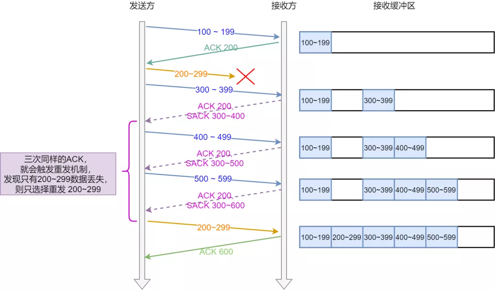

### TCP如何保证可靠性

---

- 三次握手可以确保双方的接收和发送功能都是正常的。通过三次握手不会出现一方发送，另一方无法接收的情况。

- 四次挥手，可以确保双方都准备好才断开连接。避免一方还在发送，另一方单方面断开连接。

- 重传机制  ：确保不会丢失包。

  - 超时重传 ：无论是数据包丢失或者确认报文丢失，发送方都会重发。直到收到ACK包

    超时重传的超时间隔一般根据RTT【Round-Trip Time 往返时延】计算加权平均数。

    每次超时重传，都会将超时间隔 * 2。

    ***超时重传有个缺点就是，等待的时间会很长，信道利用率低。***

  - 快速重传 ： 不以时间为驱动，以数据驱动重传。如图：

    ​	当发送丢包时，接收方会一直发送丢失包前面一次的数据包的ACK报文。

    ​	直到发送方重发丢失的包，才会发送下一个ACK报文。

    ​	发送方收到三次相同的ACK报文就重发丢失的数据包。

    ​	缺点是：**重发的包的数量不确定，是将丢失的包之后的包全部重发，还是只重发丢失的包**。

  - SACK 【Selective Ack】 ：选择性确认

    SACK机制是，在TCP头部添加一个SACK的东西，用来记录收到的包。这样发送方就可以确认哪些数据收到了，哪些没收到。

    SACK需要双方都支持，linux系统需要打开：

    `net.ipv4.tcp_sack`

  - Duplicate SACK

    使用SACK来告诉发送方有哪些数据被重复接收了。

    

    此处的SACK记录的是重复接收到的包，通过和ACK结合，可以确定是丢包了还是网络延迟。

- 滑动窗口

  TCP发送机制不可能等待每个包的ACK报文回来再发送下一个报文，这种方式虽然简单但是信道利用率很低。

  为了解决这个问题，引入了窗口的概念。在窗口内，可以**不等待ACK报文**，持续发送到窗口的最大值。

  还有一个优点是，即使某个ACK报文丢失了，可以通过最大的ACK值来确认是ACK丢了还是数据包丢失，从而决定要不要重发。这种叫**累计应答**。

  窗口的大小，通常由**接收方**的接受能力来决定。避免接收方来不及处理数据。

  **发送方的滑动窗口：**

  

  

  ​	**SND.WND** ：发送窗口大小

  ​	**SND.UNA** ：已发送但未收到ACK包的最小序列

  ​	**SND.NXT** ：可发送窗口中的下一个序列号

  ​	

  可用窗口大小：SND.WND - (SND.NXT - SND.UNA)

  

  **接收方的滑动窗口：**

  

  

  RCV.WND ：还可以接收的窗口大小

  RCV.NXT : 还可以接收的下一个数据的序列号

  接收方的窗口和发送方的窗口大小并不相等，因为窗口时会变化的（比如进程的处理速度突然变快/变慢），接收方会告诉发送方调整窗口大小。

- 流量控制

  接收方可以通过告知发送方自己的接收窗口大小，来控制发送方的发送速度。

  ​	当设置为0时，就停止了发送。设置为0时，发送方会**定时发送探测报文**，以确认窗口是否调整。

  ​	窗口大小与接收缓冲区相关，直接调整缓存区大小，会导致包丢失。因此操作系统要先收缩窗口，再减少缓存。

  ​	TCP + IP的报文头有40字节，为了避免吗，每次只发几个字节的情况：

  ​	接收方，在窗口大小小于 min(MSS , 缓存空间 / 2 )时，就会告知发送方窗口为0。阻止远程继续发送。

  ​	发送方，发送包需要满足以下条件中的一条【基于Nagle算法】：

  ​	窗口大小 >= MSS  ， 或者 数据大小 >= MSS

  ​	收到之前发送数据的ACK包

  ​	如果是发送小数据包的场景，需要关闭Nagle算法。

- 拥塞控制 ：避免网络拥堵。如果网络环境差，直接发送大批量数据包，会导致大批量丢失，继而重发，进一步加剧网络拥堵。如果当前网络较差，TCP会自我牺牲，降低发送量。

  - 拥塞窗口 ：cwnd ，**根据网络状态动态变化**。与之前的swnd【send 发送窗口】 和 rwnd【receive 接收窗口】相关， `swnd = min ( cwnd , rwnd ) ` ， 取最小值。

  - 慢启动 ：刚建立连接时，会一点一点【通过调整`cwnd`大小来提高】发送数据包的数量。规则是 ：**发送方每收到一个ACK，cwnd + 1**。当`cwnd < sstresh`，使用慢启动算法；当`cwnd >= ssthresh`，就使用拥塞避免算法。`ssthresh` 默认为 65535字节。

  - 拥塞避免算法：每收到一个ACK时，`CWND`增加 `1/cwnd`

    前面提到的超时重传和快速重传有不同的的拥塞发送算法：

    - 如果是超时重传，则会使用拥塞发送算法。

      > ssthresh = cwnd /2
      >
      > cwnd = 1

      再次将进入慢启动。这种方式太激进了

    - 如果是快速重传，则会使用以下步骤。

      > cwnd = cwnd / 2
      >
      > ssthresh = cwnd
      >
      > 进入快速恢复算法：

  ​	

  

  

  ​	